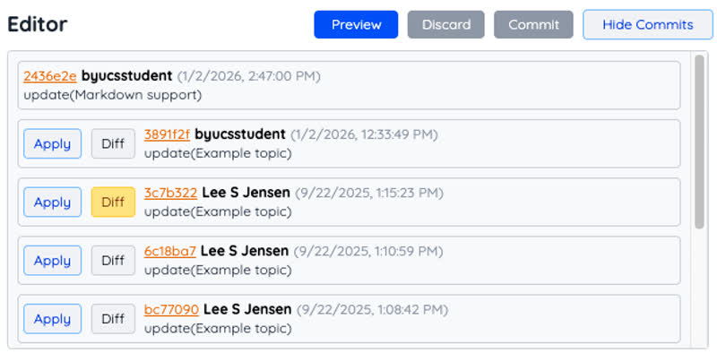
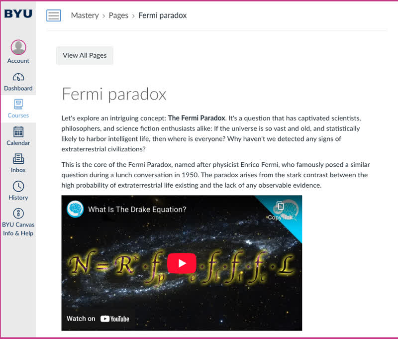
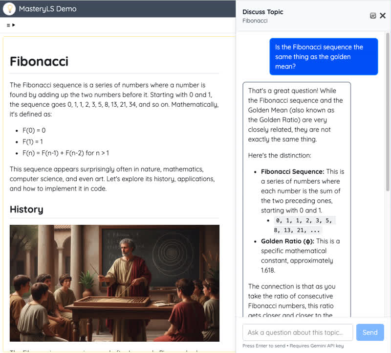

# MasteryLS Demo

Welcome to the demonstration course for MasteryLS. The content is crafted to quickly familiarize you with the major features of MasteryLS while actually experiencing the application. 

## Features

### GitHub

MasteryLS uses your GitHub repository to store and manage the course content. This means you are using the world's most popular and powerful content management system. You also have complete control of your content and can easily deploy it to multiple delivery channels or remove all access to your content.

### Content management

All course changes are versioned, comparable, and reversible. This makes it easy to see what your content looked like a year ago, fix a mistake, see who made a change, or revert to a previous version. Because each file is version controlled you can have multiple instructional designers working at the same time.

Course and topics may be published, under development, or unpublished. Make any user an editor, or remove an editor at any time. You can even _delete protect_ so that you don't accidentally lose your content.  

### Compatible

Your content is available from your GitHub repository and changes made in MasteryLS are immediately synced. You can even export and sync your MasteryLS course to an Instructure Canvas course.

Once you have connected your course to Canvas you can update all topics, or push a single topic, at any time. Any feature that is not compatible with Canvas, such as AI mentoring and feedback, is automatically removed from the Canvas version of the course.

### Advanced editor

In order to keep up with the educational needs of your learners you must be able to generate and maintain content easily. MasteryLS make that easy by simplifying the content representation with **Markdown** instead of incompatible, complex, and insecure HTML. Use drag and drop to add files and manipulate the course structure. Hotkeys allow you to execute most common editing tasks.

* Multiple select, search and replace, spell checking, syntax highlighting, and color coding.
* Simplified [markdown](/course/51a72d23-50ab-4147-a1db-27a062aed771/topic/33344322454747d6a7d8da1c57825e1f) content editing for clarity and consistency.
* All major [media](/course/51a72d23-50ab-4147-a1db-27a062aed771/topic/b6c7df2a-699f-43a8-8508-08630dcc5cc6) types supported.
*  Maximize learner attention with video, audio, images, and rich textual content.

### Topic types

You can support a diverse audience of learners with different instructional topic types.

* [Text](/course/51a72d23-50ab-4147-a1db-27a062aed771/topic/339990d2454747d6a7d8da1c57825e1f): Free flowing insturctional text with embedded media types and quiz questions.
* [Quiz](/course/51a72d23-50ab-4147-a1db-27a062aed771/topic/3a6127b6-eb69-4fb9-bb09-b45d6f8a39d8): A collection of quiz questions that expidite learning outcomes. AI provides automatic feedback and exploration.
* [Exam](/course/51a72d23-50ab-4147-a1db-27a062aed771/topic/33ccbb16c3e243d39c8d1b0f3b64d52e): A collection of quiz questions that measures mastery and only provides feedback upon completion. Mentors review and provide feedback to the learner's mastery demonstration.
* [Video](/course/51a72d23-50ab-4147-a1db-27a062aed771/topic/3330b0df266449eadc8f4e9a1e966b6): Full screen video playback as an individual topic.
* [Project](/course/51a72d23-50ab-4147-a1db-27a062aed771/topic/a6b219fb77674ee783e43d326b0a697c): Mastery demonstration with a project artifact that is mentor graded and reviewed. After submission, a project then becomes part of the learner's mastery portfolio.

### AI integration

MasteryLS was designed from the beginning with AI as an integral part of the experience. This accelerates learning and reduces mentor overhead.

* **Content generation**: Editors use AI to generate a courses, topics, sections, quizzes, and [exams](/course/51a72d23-50ab-4147-a1db-27a062aed771/topic/33ccbb16c3e243d39c8d1b0f3b64d52e). Editors can then easily enhance and modify the generated content in order to produce a production ready result.
* **Learning feedback**: Learners receive immediate feedback to [quizzes](/course/51a72d23-50ab-4147-a1db-27a062aed771/topic/3a6127b6-eb69-4fb9-bb09-b45d6f8a39d8), exams, and project submissions. Mentors can augment and overwrite AI responses.
* **Topic discussion**: Learner can deepen their understanding and ask clarifying questions with the context aware AI discussion mentor.

### Personalized Dashboard

The individualized dashboard shows available courses, enrollments, and progress. The learner, mentor, and administrator can also easily access metrics and logs to view individual performance.

### Metrics

A learner, mentor, or administrator can access the [visualizations](/metrics) for time spent on each course and activity. This helps determine productivity and focus.

### Progress

A [detailed log](/progress) for everything a learner does is tracked of all course interactions and accomplishments. A learner can use this to demonstrate progress. A mentor or administrator and compare progress across courses, activities, peers, and cohorts.

## Example topics

The _Example topics_ module demonstrate different instructional patterns that were first generated using AI and then manually curated by an instructional designer.

1. **[Cheese](/course/51a72d23-50ab-4147-a1db-27a062aed771/topic/140d86ce9e9b4ce59fd095bb959c9df4)**: An introduction to the making of cheese.
1. **[Fermi paradox](/course/51a72d23-50ab-4147-a1db-27a062aed771/topic/9c579dfa72f7447c8f14e38d916ef377)**: Discussion of the possibility of extra terrestrial life with embedded quiz. 
1. **[React hooks](/course/51a72d23-50ab-4147-a1db-27a062aed771/topic/b0c37fd40a8145b3ac59cc55737831f8)**: General overview of React hooks with extensive coding examples.
1. **[React useContext](/course/51a72d23-50ab-4147-a1db-27a062aed771/topic/045a285e6d22421db93f626f640808e5)**: Deep dive into the `useContext` hook.
1. **[Fibonacci](/course/51a72d23-50ab-4147-a1db-27a062aed771/topic/b5b9c3d4-7f35-4fde-b1a0-0430e01347bf)**: History and explanation of the Fibonacci sequence.
1. **[Implementing Fibonacci](/course/51a72d23-50ab-4147-a1db-27a062aed771/topic/15080d65-34c4-4564-8a72-7e067d556295)**: Step by step instruction on the complexities of implement Fibonacci.