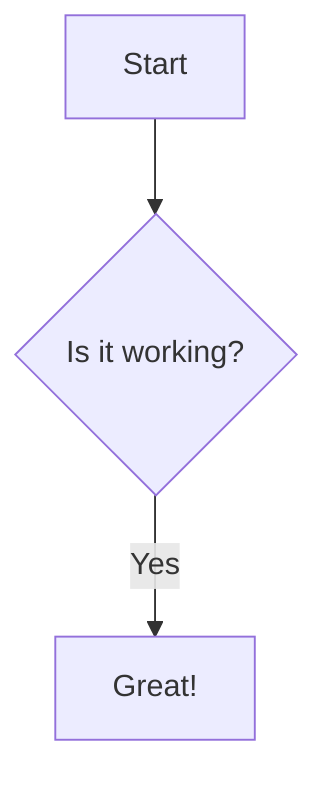

# Markdown support

This is the content of the instruction. It can include **bold text**, _italic text_, <sub>sub</sub>, <sup>super</sup>, and even [links](https://byu.edu).

## Footnotes

Here is a footnote reference.[^1]

[^1]: This is the footnote.

## Lists

- Item 1
- Item 2

* Item 1
* Item 2

- nested
  1. cow
  1. rat
  1. dog
- more
  1. apple
  1. pie

## Section links

[Link to mentions](#mentions)

## Code Blocks

This is `inline code` rendering.

```jsx
import React, { useState } from 'react';

function Namer({  }) {
  const [name, setName] = useState('');
  return <div onClick={setName('Sally')}>{name}</div>
}
```

```
All the world's a stage,
And all the men and women merely players;
They have their exits and their entrances;
And one man in his time plays many parts,

— Jaques, *As You Like It*, Act II, Scene VII

This renowned monologue serves as an excellent example of Shakespearean dramatic verse, showcasing intricate character portrayal through an extended metaphor and vivid descriptive language. It offers rich opportunities for analyzing thematic development, rhetorical strategies, and the structure of blank verse within a theatrical context.
```

```python
import pandas as pd
import numpy as np

# Sample DataFrame for demonstration of advanced data transformations
df_sales = pd.DataFrame({
    'transaction_id': [1001, 1002, 1003, 1004, 1005, 1006, 1007, 1008, 1009, 1010, 1011, 1012, 1013, 1014, 1015],
    'customer_id': ['CUST001', 'CUST002', 'CUST001', 'CUST003', 'CUST002', 'CUST004', 'CUST001', 'CUST005', 'CUST003', 'CUST004', 'CUST001', 'CUST006', 'CUST002', 'CUST005', 'CUST006'],
})
```

## Mermaid Diagram



## Blockquote and Important Note

> This is a blockquote.

> [!IMPORTANT]
>
> This is an important note that should be highlighted.

## Tables

| Syntax    | Description |
| --------- | ----------- |
| Header    | Title       |
| Paragraph | Text        |

## Task Lists

- [x] Feature 1
- [ ] Feature 2
- [ ] Feature 3

## Strikethrough

~~This was mistaken text~~

## Emoji

:smile: :rocket: :tada: :+1:

## Images


## Mentions

@leesjensen - you are needed

## Issue/PR References

#1 - relative

leesjensen/masteryls#1 - absolute

softwareconstruction240/softwareconstruction#297 - absolute

## Autolinked URLs

https://github.com

## Inline HTML

<span style="color: red;">This is red text</span> cow</br>rat

## Collapsed summary

<details>
<summary>My top languages</summary>

| Rank | Languages  |
| ---: | ---------- |
|    1 | JavaScript |
|    2 | Python     |
|    3 | SQL        |

</details>

## Horizontal lines

---
